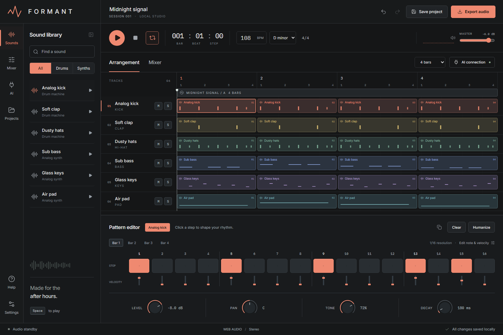
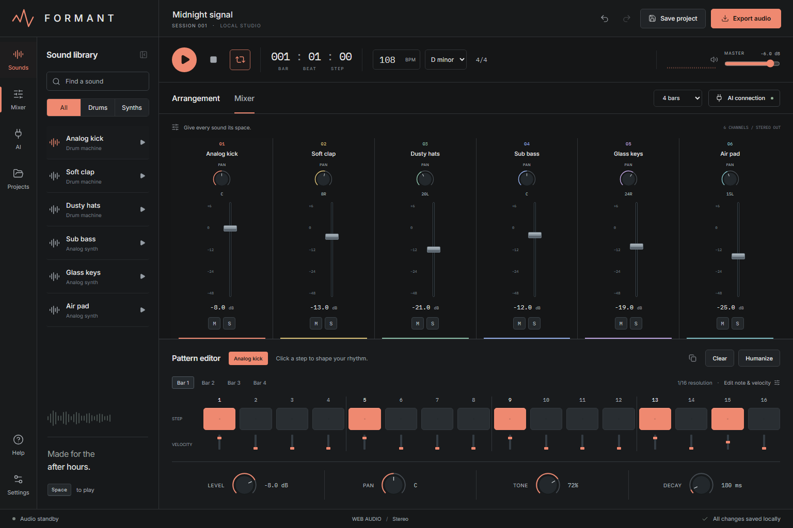
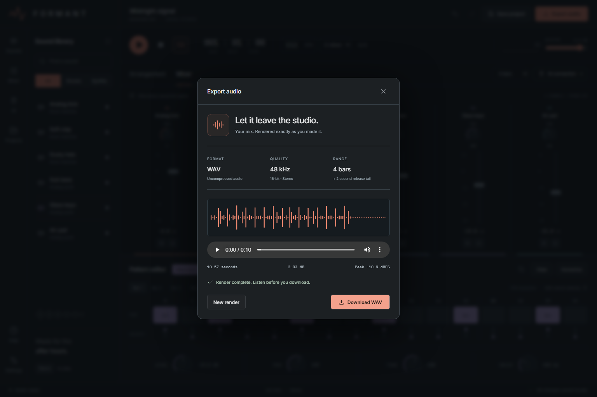

# FORMANT

<p align="center"><strong>A tactile, local-first groove studio for humans and AI.</strong><br/>Compose patterns, shape sound, and hand the session to an MCP-connected collaborator.</p>

<p align="center">
  
</p>

<p align="center"><sub>Runs locally in a modern browser on Windows and macOS · no cloud account required</sub></p>

<p align="center">
  <a href="#start-the-studio">Get started</a> · <a href="#connect-an-ai-with-mcp">Connect an AI</a> · <a href="docs/reviews/pass-2.md">See the review</a>
</p>


FORMANT is a focused digital audio workstation for making short, expressive loops. It combines a polished step editor, playable Web Audio synthesis, a mixer, measured WAV export, and a local MCP server so an AI can read and edit the same session.

<p align="center">
  
  
</p>

Six synthesized instruments, four editable bars, and one focused workspace keep the surface quick to learn while leaving room for detailed sound design.

## Start the studio

Requires **Node.js 22.12 or newer** and a modern browser.

```sh
npm ci
npm run build
npm run launch
```

Open **http://127.0.0.1:4317**. Windows: double-click `Setup and Launch.cmd` the first time; use `Launch FORMANT.vbs` afterward for a hidden background launch. macOS: run `bash "Launch FORMANT.command"` from Terminal. This installs project dependencies if needed and opens your browser. Nothing is installed as a startup service.

`npm run stop` stops only a verified FORMANT server at the configured address. `npm start` runs the server in the current terminal. The optional `FORMANT_PORT` environment variable selects another explicitly chosen loopback port; the app never evicts an existing listener or silently picks a different port.

## Make something

- Press **Play** or **Space**. The seeded Midnight signal session is playable immediately. Browser audio requires that first click.
- Select an instrument or a clip. Click the 16 pads to shape one bar. Adjust velocity below each step, or open **Edit note & velocity** for precise values and pitches.
- Use the four **Bar** buttons to write variations. The copy button repeats the current pattern across all bars. **Humanize** varies active-step velocities; **Clear** clears only the current bar.
- Shape each sound with **Level, Pan, Tone, Decay**. Use **Mixer** for all six channel faders. **M** mutes and **S** solos; mute takes precedence.
- Set BPM, minor key, loop length and master volume. Swing is in **Audio settings**. **Projects** offers two starters, a blank session and project-file import.
- **Save project** downloads a portable `.formant.json`. **Export audio** renders the active bars plus a two-second release tail to 48 kHz stereo 16-bit PCM WAV. The render follows actual note, velocity, mute, solo, pan, tone and decay settings. Audio settings shows measured export peak, RMS, duration and file size.

Current edits are saved atomically to `.formant/session.json`. Undo/redo retains 100 edits during the service lifetime. Loading a project or preset is undoable. Closing the browser stops playback; reopening restores the saved session. No files or audio are sent to a cloud provider by FORMANT.

## Connect an AI with MCP

Open **AI connection → Copy configuration**, then add that configuration to your MCP-compatible client. Or generate the exact local configuration:

```sh
node scripts/mcp-config.mjs
```

The MCP server uses stdio and the official TypeScript SDK. The local web service must be running. Keep a studio browser open for transport and export; session edits can run without a browser. Click Play once before asking an AI to start playback. A transport response acknowledges delivery; `formant_get_session` reports the browser's actual runtime.

| Tool | Purpose |
|---|---|
| `formant_get_session` | Read saved session, revision, history availability, browser runtime |
| `formant_set_session` | Name, tempo, key, bar length, swing, master and loop |
| `formant_set_track` | Instrument level, pan, tone, decay, mute, solo and name |
| `formant_set_pattern` | Replace a zero-based bar with 16 velocities and optional MIDI notes |
| `formant_set_step` | Set an event at index 0–63 |
| `formant_transport` | Request play, pause or stop |
| `formant_load_preset` | Midnight, Daybreak or empty session |
| `formant_history` | Undo or redo an edit |
| `formant_export_audio` | Render a WAV through the browser and return a local file receipt |
| `formant_get_export` | Read an export job's actual completion state |

Also includes `formant://session` and the `produce_loop` prompt. AI exports are confined to `.formant/exports`; no arbitrary paths, shell commands or credential access are exposed. Jobs are kept for the current server lifetime; completed WAV files persist.

Suggested first request: “Read my FORMANT session. Make the bass more syncopated, soften the hats, and set the tempo to 112. Read back the changes.”

## Development and evidence

```sh
npm run typecheck
npm test
npm run test:mcp
node scripts/verify-mcp.mjs --export
```

The MCP verifier makes temporary session edits and restores the captured session. Run it only in an idle test session. The export check needs a studio browser open. `scripts/capture-qa.mjs` captures independent Chromium viewports and runs Axe checks; install its matching browser with `node node_modules/playwright/cli.js install chromium`, or set `FORMANT_BROWSER_PATH` to an existing compatible headless Chromium executable. Runtime and test dependencies are locked in `package-lock.json`.

See `docs/DESIGN.md`, `docs/QA.md`, and the four independent vision reports in `docs/reviews/`. The screenshot reference is `docs/concept.png`.

This release is a synthesis-based groove workstation. Microphone recording, sample import, VST/AU hosting, arbitrary track creation and a built-in cloud language model are outside this release. The MCP interface lets your chosen AI collaborate. Windows runtime is verified; macOS source/launcher portability does not substitute for testing on a physical Mac.

## Architecture and sources

React/Vite interface → one validated command reducer → atomic Node session store. Browser SSE updates provide shared state and explicit transport/export delivery. Look-ahead Web Audio scheduling and OfflineAudioContext rendering use the same instrument graph.

Implementation references: [MDN Web Audio scheduling](https://developer.mozilla.org/en-US/docs/Web/API/BaseAudioContext), [OfflineAudioContext](https://developer.mozilla.org/en-US/docs/Web/API/OfflineAudioContext), and the [official MCP TypeScript SDK server guide](https://ts.sdk.modelcontextprotocol.io/server). See `package-lock.json` for the installed versions.
